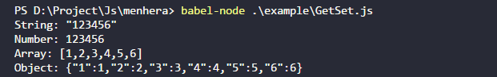

# Menhera

an experimental lovely frame

### Install

```bash
yarn add menhera
```

### Example

```js
import Menhera from "menehra";

const test = ({ _val }) => console.log(_val);
const testFn = ({ _val }) => console.log(_val());
const testEach = ({ _val }) => {
  typeof _val === "function" && testFn({ _val });
  typeof _val !== "function" && test({ _val });
};
const testRoot = ({ _val }) => {
  for (let [key, val] of Object.entries(_val)) {
    testEach({ _val: val });
  }
};

const _ = new Menhera({
  _hooks: {
    foo: {
      bar: {
        foo1: {
          bar1: {
            $: testEach,
            _: testRoot,
            test,
            testFn
          }
        }
      }
    }
  },
  foo: {
    bar: {
      foo1: {
        bar1: {
          test: "foo bar",
          testFn: () => "foo bar"
        }
      }
    }
  }
});
```


```js
const _ = new Menhera({
  _hooks: {
    foo: {
      bar: {
        $({ _key, _val }) {
          console.log(`${_key}: ${JSON.stringify(_val)}`);
        }
      }
    }
  }
});

_.$set({
  foo: {
    bar: {
      String: "123456",
      Boolean: false,
      Number: 123,
      Array: ({ tar = [1, 2, 3] }) => tar,
      Object: ({ tar }) => ({
        1: 1,
        2: 2,
        3: 3
      }),
      Function: ({ tar }) => val => val + 1
    }
  }
});

_.$use(
  _.$get({
    foo: {
      bar: {
        String: "",
        Boolean: ({ tar }) => !tar,
        Number: ({ tar }) => tar + 123333,
        Array: ({ tar }) => [...tar, ...[4, 5, 6]],
        Object: ({ tar }) => ({ ...tar, ...{ 4: 4, 5: 5, 6: 6 } }),
        Function: ({ tar }) => tar(123455)
      }
    }
  })
);
```


